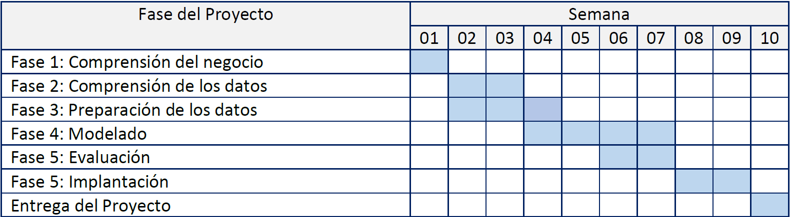

## Justificación del Proyecto

La industria del videojuego digital es un entorno altamente competitivo, donde la visibilidad y la aceptación del público condicionan directamente el éxito comercial de un título. En plataformas como **Steam**, miles de juegos compiten simultáneamente, y las métricas de valoración de usuarios constituyen una señal clave de popularidad y rendimiento.

Este proyecto aplica fundamentos de Ciencia de Datos para:

- Analizar patrones asociados a la recepción de los juegos,  
- Identificar factores relevantes en su popularidad,  
- Construir modelos predictivos sencillos e interpretables.

El objetivo principal es desarrollar un flujo reproducible que conecte exploración, preparación y modelización.

## CRISP-DM como Metodología

El proyecto se estructura siguiendo las fases del estándar **CRISP-DM** (*Cross-Industry Standard Process for Data Mining*), adaptado al análisis de videojuegos:

1. Comprensión del negocio  
2. Comprensión de los datos  
3. Preparación de los datos  
4. Análisis exploratorio (EDA)  
5. Modelado  
6. Evaluación  
7. Presentación de resultados

Este marco garantiza un desarrollo lógico y sistemático del análisis.

## Problema de Negocio y Preguntas de Investigación

El problema abordado es comprender y predecir la popularidad de videojuegos en Steam utilizando atributos disponibles en el catálogo.

Se plantean las siguientes preguntas:

- ¿Qué variables del catálogo se asocian con un mayor número de valoraciones positivas?
- ¿Existen patrones sistemáticos según precio, plataformas o categorías?
- ¿Es posible predecir si un juego será altamente popular a partir de sus características?

## Objetivos

### Objetivo general

Desarrollar modelos predictivos para explicar y estimar la popularidad de videojuegos en Steam a partir de variables de catálogo.

### Objetivos específicos

- Realizar un análisis exploratorio del dataset Steam para identificar distribuciones, outliers y relaciones relevantes.
- Preparar los datos mediante limpieza, transformación y generación de variables derivadas.
- Ajustar un modelo de **regresión lineal** para modelar el volumen de valoraciones positivas (en escala logarítmica).
- Ajustar un modelo de **regresión logística** para clasificar juegos populares (top 10%).
- Evaluar los modelos mediante métricas apropiadas y discutir sus limitaciones.
- Documentar todo el proceso en un informe reproducible en formato Quarto Book.

## Fuentes de Datos

**Dataset utilizado**

Se emplea el dataset **Steam Games Catalogue**, descargado desde Kaggle, que contiene información de miles de videojuegos disponibles en Steam.

Incluye variables como:

- Precio (`price`)
- Edad mínima (`required_age`)
- Plataformas soportadas (`windows`, `mac`, `linux`)
- Categorías, géneros y etiquetas
- Valoraciones positivas y negativas (`positive_ratings`, `negative_ratings`)

## Plan de Trabajo

La siguiente tabla describe el cronograma del proyecto en semanas:

{fig-alt="Cronograma del proyecto" width="85%"}

## Metodología

El enfoque metodológico se basa en las fases de **CRISP-DM** (*Cross-Industry Standard Process for Data Mining*), adaptadas al objetivo del proyecto: analizar y predecir señales de popularidad en videojuegos de Steam a partir de variables de catálogo. Este marco proporciona una estructura ordenada para conectar el problema, los datos, la preparación, el modelado y la evaluación.

### Comprensión del negocio

- **Necesidad / objetivo analítico**: entender qué atributos de un videojuego (precio, plataformas, metadatos de catálogo) se asocian con una mayor aceptación por parte de usuarios y si es posible anticipar dicha aceptación con modelos simples.
- **Traducción a preguntas operativas**:
  - ¿Qué variables se relacionan con un mayor volumen de valoraciones positivas?
  - ¿Qué patrones se observan por precio, plataformas soportadas y metadatos (géneros, categorías, etiquetas)?
  - ¿Se puede construir un modelo que clasifique juegos “populares” con criterios reproducibles?
- **Definición de objetivos modelizables**:
  - Regresión: estimar $log(1+positive\_ratings)$ como proxy continuo de recepción.
  - Clasificación: predecir `popular` como pertenencia al top 10% en `positive_ratings` (criterio definido en preparación).

### Comprensión de los datos

- **Revisión inicial del dataset**:
  - Identificación de estructura (tipos de variables: numéricas, binarias/categóricas) y coherencia de rangos.
  - Revisión de distribuciones y posibles asimetrías (p. ej., ratings con cola larga).
- **Calidad de datos**:
  - Detección de valores faltantes (si existen) y evaluación del impacto en variables clave.
  - Identificación de valores atípicos evidentes (p. ej., precios extremos o recuentos anómalos).
- **Contextualización de variables**:
  - Variables de catálogo (precio, plataformas, metadatos) como predictores disponibles **antes** de la respuesta del mercado.
  - Variables de valoración (positive/negative ratings) como resultados observados del comportamiento de usuarios.

### Preparación de los datos

- **Limpieza y consistencia**:
  - Revisión de tipos de datos y recodificación si procede (p. ej., indicadores lógicos a 0/1 cuando el modelo lo requiera).
  - Tratamiento de inconsistencias básicas (valores imposibles o no informativos).
- **Transformaciones del target**:
  - Para regresión, se transforma el target mediante $y=log(1+positive\_ratings)$ con el fin de reducir asimetría y estabilizar parcialmente la varianza.
- **Ingeniería de variables**:
  - Generación de variables derivadas relevantes para modelado (p. ej., conteos de categorías/géneros/tags y transformaciones logarítmicas de variables con cola larga como precio o logros).
- **Persistencia del dataset preparado**:
  - Guardado del dataset final preprocesado en `data/steam_model.rds` para garantizar que los capítulos de modelado reutilicen exactamente la misma versión de datos.

### Análisis exploratorio de datos (EDA)

- **Distribución de variables clave**:
  - Exploración de asimetrías, dispersión, outliers y escalas (especialmente en ratings y precio).
- **Relaciones bivariadas**:
  - Evaluación de patrones preliminares entre predictores y variables objetivo (p. ej., asociación entre precio y popularidad; diferencias por soporte de plataforma).
- **Hipótesis de trabajo para modelado**:
  - Identificación de variables plausiblemente informativas y de relaciones no lineales que puedan justificar transformaciones.

### Modelado

- **Regresión lineal (baseline explicable)**:
  - Ajuste de un modelo lineal para $log(1+positive\_ratings)$, con separación train/test y evaluación de errores (RMSE/MAE).
  - Objetivo: obtener una aproximación interpretable y cuantificar capacidad predictiva básica.
- **Regresión logística (clasificación binaria)**:
  - Ajuste de un modelo logístico para predecir `popular` (top 10% por `positive_ratings`).
  - Objetivo: modelar $P(y=1\mid X)$ y analizar la contribución relativa de predictores mediante `odds ratios`.

### Evaluación

- **Regresión**:
  - Evaluación del rendimiento con métricas en test (RMSE y MAE) y diagnóstico cualitativo mediante análisis de residuos.
  - Discusión de estabilidad del error a lo largo del rango del target (p. ej., mayor error en juegos extremadamente populares).
- **Clasificación**:
  - Evaluación con métricas adecuadas a desbalance (precision, recall, AUC) y revisión de calibración.
  - Interpretación de coeficientes (OR) y discusión de limitaciones del proxy `popular`.

### Entregables

- Informe técnico reproducible en **Quarto Book**, con:
  - Justificación, metodología, EDA, preparación, modelado y evaluación,
  - Resultados interpretados y conclusiones.

## Tecnología

### Lenguaje y entorno

- **R** como lenguaje principal para la manipulación de datos, visualización y modelado estadístico.
- Desarrollo en **RStudio** para ejecución interactiva y depuración.
- Documentación reproducible con **Quarto Book**, integrando narrativa, tablas y figuras generadas desde R.

### Librerías principales

- **Manipulación de datos**:
  - `dplyr`, `tidyr`
- **Visualización**:
  - `ggplot2`
- **Modelado y utilidades**:
  - `stats` (ajuste de modelos lineales y logísticos)
  - `broom` (extracción ordenada de coeficientes y métricas)

### Gestión de versiones

Uso de GitHub para documentar el progreso y mantener el historial de versiones en:
`https://github.com/MiguelAngelRjTr/Proyecto-Fundamentos-de-la-Ciencia-de-Datos.git`
  
